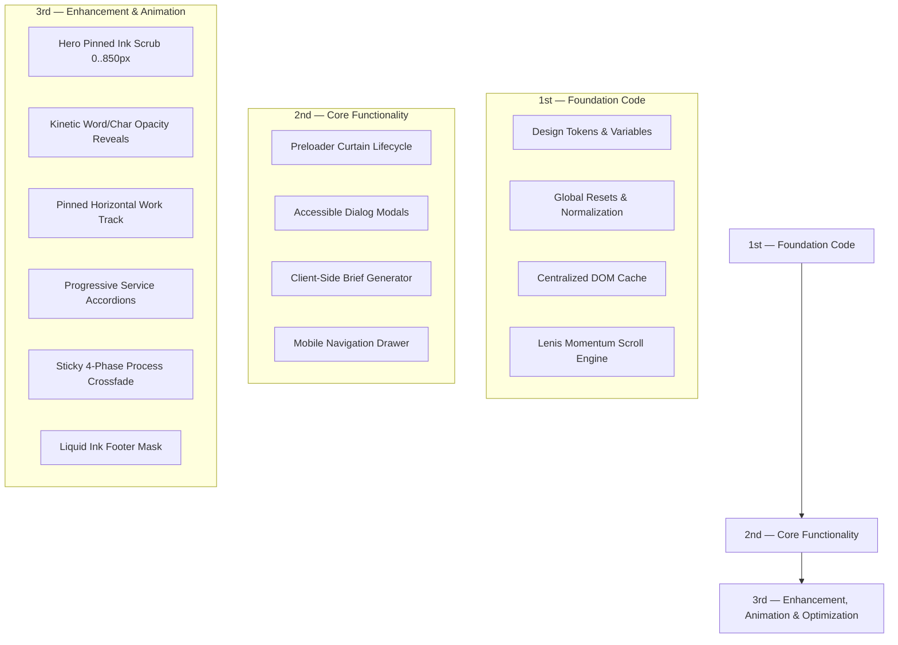

# PAJULGAN — Architecture & Guidelines

A modular, framework-free vanilla web architecture designed for maximum performance, maintainability, editorial elegance, and zero-build overhead.

---

## 1. Directory Structure

```text
PAJ2/
├── index.html                       # Primary entry point & semantic HTML5 document
├── styles.css                       # Root stylesheet gateway (imports css/main.css)
├── app.js                           # Root application bundle & fallback bootstrap
├── ARCHITECTURE.md                  # Comprehensive architectural blueprint & guidelines
├── RULES.md                         # Engineering workflow & quality standards
├── README.md                        # Project briefing & local server run instructions
├── DOCUMENTATION.md                 # Full technical documentation & section breakdown
├── assets/                          # Static media, vector assets & local libraries
│   ├── 1st.png                      # Phase 01 Process study graphic
│   ├── 2nd.png                      # Phase 02 Process study graphic
│   ├── 3rd.png                      # Phase 03 Process study graphic
│   ├── 4th.png                      # Phase 04 Process study graphic
│   ├── CodecCold-ExtraBold.woff     # Custom display wordmark typeface
│   ├── courtyard.jpg                # Architectural concept photography (The Courtyard House)
│   ├── pavilion.jpg                 # Architectural concept photography (The Common Ground)
│   ├── structure.jpg                # Architectural concept photography (Framework / 03)
│   ├── custom-hero-sketch.jpg       # Axonometric wireframe CAD drafting visual
│   ├── custom-hero-render.jpg       # Photorealistic architectural render
│   ├── logo-p.svg                   # Brand mark vector
│   ├── mark.svg                     # Favicon symbol
│   ├── sources.txt                  # Image attribution & reference citations
│   ├── gsap.min.js                  # Local GSAP core library
│   ├── ScrollTrigger.min.js         # Local ScrollTrigger plugin
│   └── lenis.min.js                 # Local Lenis smooth momentum scroll library
├── css/                             # Modular CSS architecture
│   ├── main.css                     # Master CSS aggregator (imports layers in cascade order)
│   ├── variables.css                # Design tokens, font-faces & CSS custom properties
│   ├── reset.css                    # Box-sizing, typography resets, paper noise texture
│   ├── global.css                   # Typography utilities, scroll progress, link primitives
│   └── components/                  # Domain & section stylesheets
│       ├── intro.css                # Preloader curtain columns & typography
│       ├── header.css               # Architectural brand lockup & mobile drawer nav
│       ├── hero.css                 # Hero pinned liquid ink showcase & SVG filter
│       ├── studio.css               # Studio manifesto layout & kinetic text reveal
│       ├── work.css                 # Selected works pinned horizontal track & cards
│       ├── services.css             # Architectural disciplines & progressive accordion
│       ├── approach.css             # 4-Phase process split & sticky photo crossfade
│       ├── contact.css              # Direct engagement section & consultation CTA
│       ├── footer.css               # Liquid ink displacement mask & colophon
│       ├── dialogs.css              # Accessible HTML5 <dialog> modals & brief form
│       └── responsive.css           # Lenis optimizations, media queries (1600, 1024, 768, 600)
└── js/                              # Modular ES6+ JavaScript architecture
    ├── app.js                       # Master application bootstrap orchestrator
    ├── core/                        # Foundational infrastructure & engine utilities
    │   ├── dom.js                   # Centralized DOM query caching
    │   └── lenis.js                 # Lenis smooth scroll engine & GSAP ticker link
    ├── components/                  # Shared interactive UI components
    │   ├── navigation.js            # Mobile menu drawer & anchor link smooth scroller
    │   ├── dialogs.js               # Accessible modal dialog controller & Lenis lock
    │   └── brief.js                 # Client-side architectural brief file generator
    └── modules/                     # Cinematic motion & animation controllers
        ├── intro.js                 # Staggered column preloader entrance timeline
        └── animations.js            # GSAP & ScrollTrigger motion suite
```

---

## 2. Three-Tier Architectural Build Order

Every subsystem in the codebase strictly follows the Senior Mentorship sequence:



### 1st — Foundation Code
1. **Design Tokens & Typography** (`css/variables.css`): Font-faces (`Codec Cold ExtraBold`, `DM Sans`, `IBM Plex Mono`), warm paper-and-ink palette (`--paper: #eeeae1`, `--ink: #292b25`, `--red: #ba452e`).
2. **Global Resets** (`css/reset.css`, `css/global.css`): Box-sizing, tactile paper noise grain overlay, focus-visible indicators.
3. **DOM Caching** (`js/core/dom.js`): Single-pass DOM element queries to eliminate layout reflows and Garbage Collection overhead.
4. **Smooth Scroll Engine** (`js/core/lenis.js`): Hardware-accelerated momentum scrolling locked into GSAP's `requestAnimationFrame` ticker via `gsap.ticker.lagSmoothing(0)`.

### 2nd — Core Functionality
1. **Curtain Preloader** (`js/modules/intro.js`, `css/components/intro.css`): 5-column architectural unveil with automatic DOM removal after completion.
2. **Accessible Native Dialogs** (`js/components/dialogs.js`, `css/components/dialogs.css`): HTML5 `<dialog>` elements for project details and project briefs with scroll locking.
3. **In-Browser Brief Export** (`js/components/brief.js`): Generates and downloads a formatted `.txt` specification client-side using `Blob` and `URL.createObjectURL`.
4. **Navigation Controller** (`js/components/navigation.js`, `css/components/header.css`): Mobile drawer toggle, Escape key dismissal, and hash-persisting smooth anchor routing.

### 3rd — Enhancement, Animation & Optimization
1. **Hero Pinned Liquid Ink Showcase** (`#heroPinWrapper`, 0..850px scrub runway): SVG bezier morphing from wireframe CAD to photorealistic render.
2. **Kinetic Word & Character Reveal** (`.word-reveal`): Splits editorial typography into characters that illuminate from opacity 0.1 to 1.0 on scroll.
3. **Calibrated Section Entrances**: Unified 85vh viewport threshold with bidirectional `'play none none reverse'` playback.
4. **Pinned Horizontal Gallery**: GSAP `matchMedia` (`(min-width: 601px)`) pin with dynamic `scrollWidth - innerWidth` translation.
5. **Progressive Service Accordions**: Auto-unfolds each discipline at 72vh threshold and triggers `ScrollTrigger.refresh()`.
6. **Sticky Process Crossfade**: 4-phase sticky photograph stack synchronized with numbered editorial stages.
7. **Liquid Ink Footer Mask**: SVG dual-circle displacement mask with real-time pointer tracking and physics ripples.

---

## 3. Motion Engineering Pipeline (5-Step Animation Order)

For every animation system in the project, implementation strictly respects this 5-stage progression:

```text
STEP 1: Build the semantic HTML structure
STEP 2: Build the CSS foundation (layout, positioning, transforms, responsive stack)
STEP 3: Initialize JavaScript & register GSAP / ScrollTrigger plugins
STEP 4: Attach ScrollTrigger behavior (pinning, scrub, thresholds)
STEP 5: Add advanced effects (SVG morphing, pointer ripples, Lenis sync)
```

---

## 4. Zero-Build Vanilla Standard

- **No Bundler Required**: Operates natively in modern browsers via vanilla HTML5, CSS3, and ES6+ JavaScript.
- **Zero CORS Bottlenecks**: Functions reliably when served via `python -m http.server 4189` or standard static hosts.
- **Progressive Architecture**: Available both as modular ES modules (`css/main.css`, `js/app.js`) and root convenience gateways (`styles.css`, `app.js`).